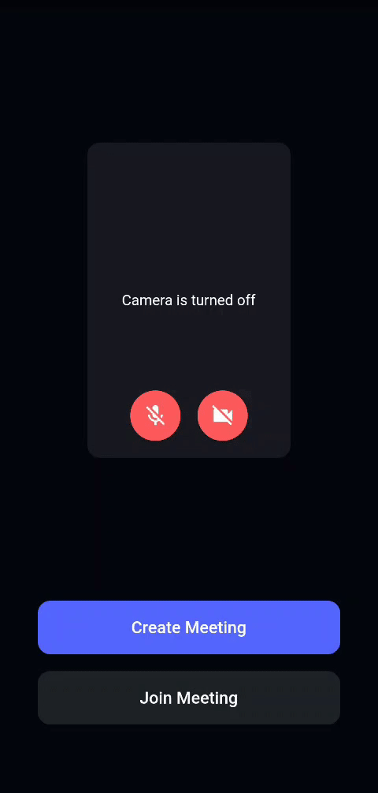
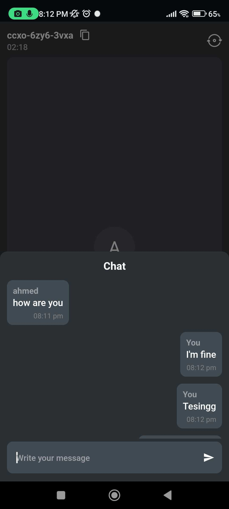
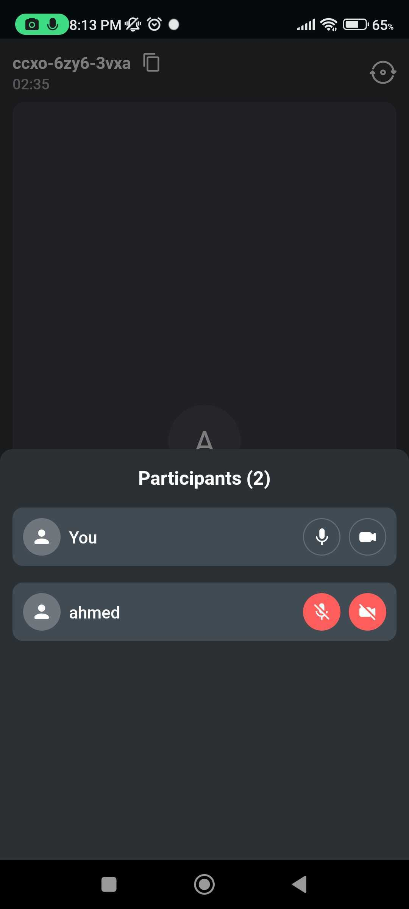
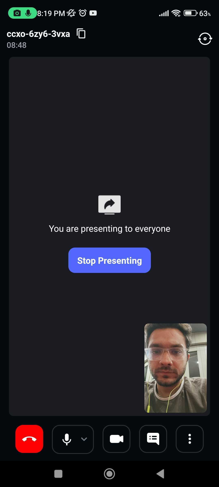
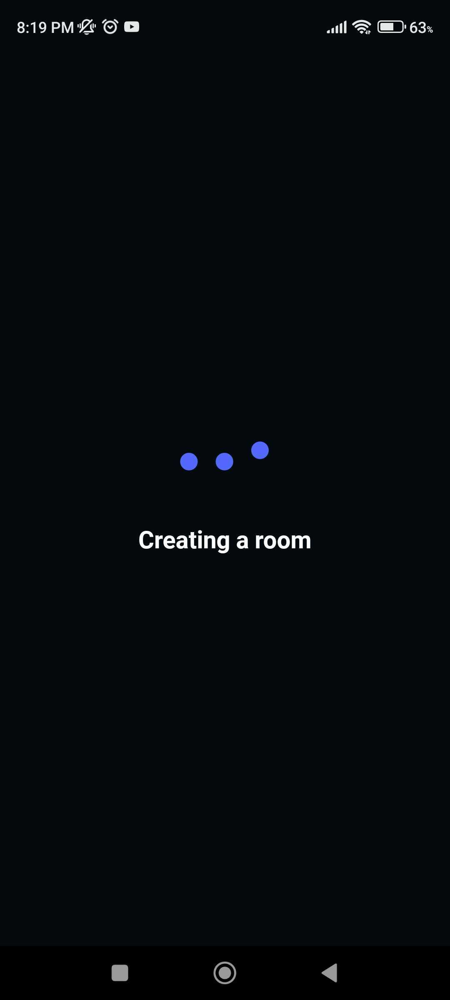
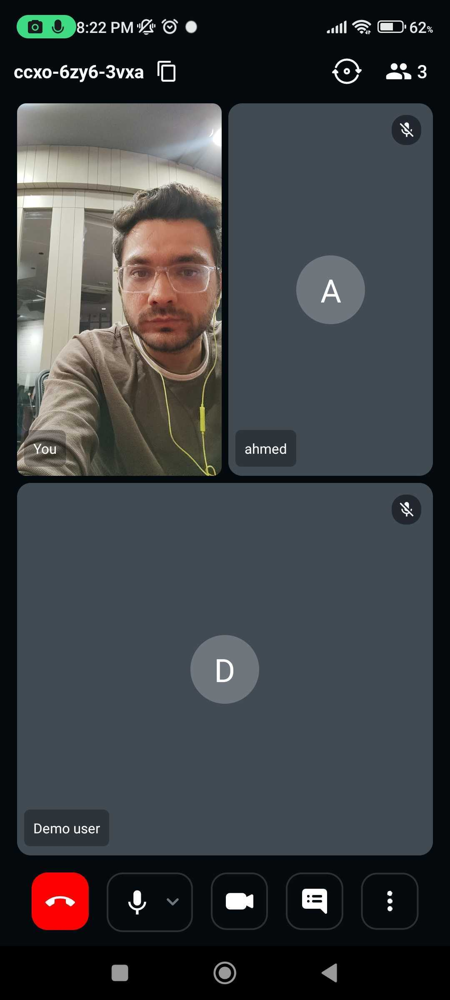
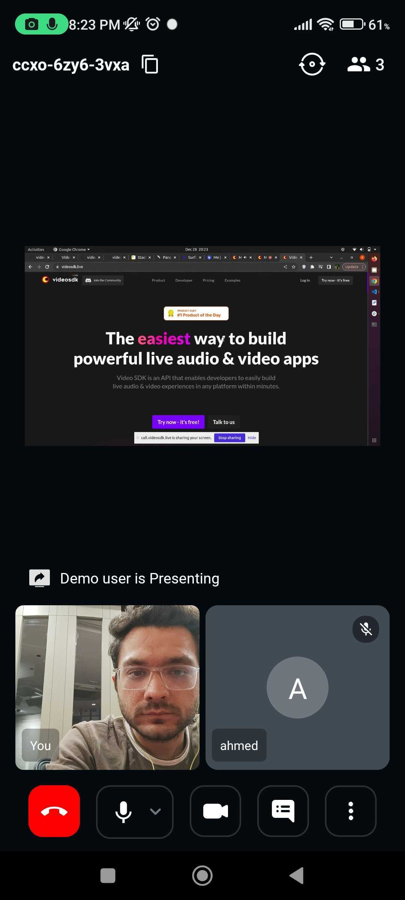
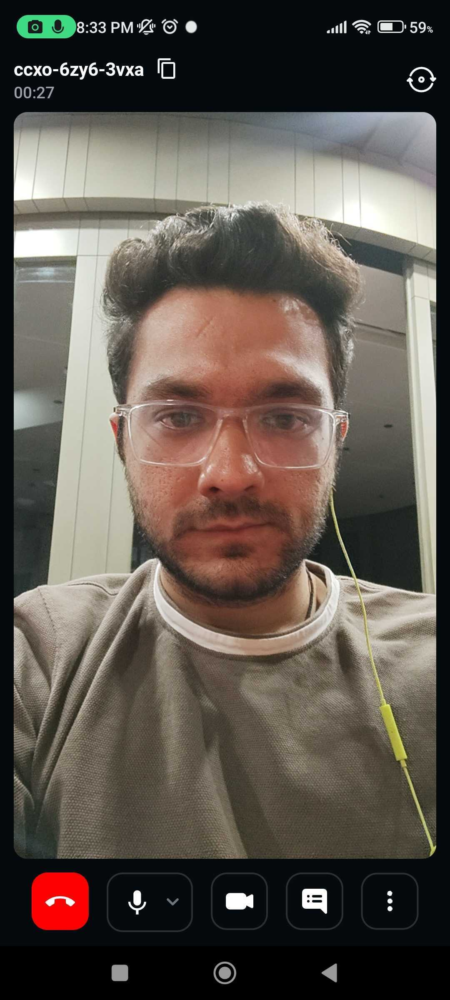
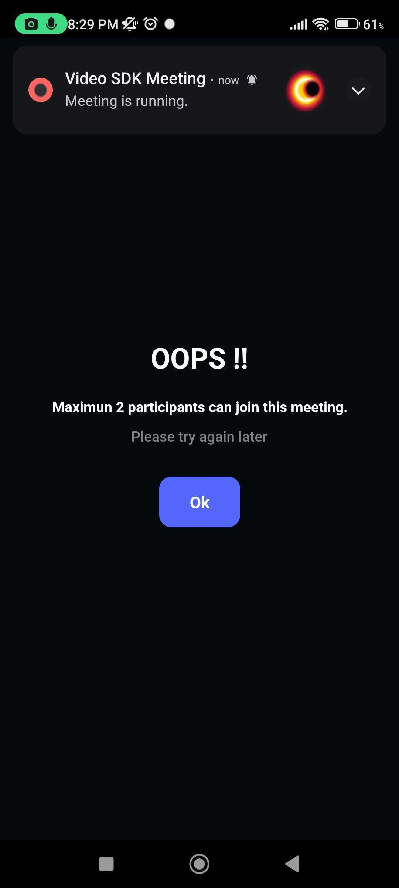

# Video SDK for React Native (Android and iOS)

[](https://docs.videosdk.live/react-native/guide/video-and-audio-calling-api-sdk/getting-started)
[](https://appdistribution.firebase.dev/i/a4c63049415c4356)
[](https://testflight.apple.com/join/LYj3QJPx)
[](https://discord.gg/bGZtAbwvab)
[](https://app.videosdk.live/signup)

At Video SDK, we’re building tools to help companies create world-class collaborative products with capabilities of live audio/videos, compose cloud recordings/rtmp/hls and interaction APIs

## Demo App

Check out demo [here](https://videosdk.live/prebuilt/)

📲 Download the Sample iOS app here: https://testflight.apple.com/join/LYj3QJPx

📱 Download the Sample Android app here: https://appdistribution.firebase.dev/i/a4c63049415c4356

<br/>

## Setup Guide

- Sign up on [VideoSDK](https://app.videosdk.live/) and visit [API Keys](https://app.videosdk.live/api-keys) section to get your API key and Secret key.

- Get familiarized with [API key and Secret key](https://docs.videosdk.live/react-native/guide/video-and-audio-calling-api-sdk/signup-and-create-api)

- Get familiarized with [Token](https://docs.videosdk.live/react-native/guide/video-and-audio-calling-api-sdk/server-setup)

<br/>

### Prerequisites

- React Native 0.59.10 or later
- Node 10 or later
- Valid Video SDK [Account](https://app.videosdk.live/)
- For Android
  - Java Development Kit (JDK) 8 or later
  - Android Studio (latest version recommended)
  - A physical or virtual mobile device running Android 5.0 or later
- For iOS
  - Xcode 9.4 or later
  - CocoaPods
  - A physical or virtual mobile device running iOS 9.0 or later

<br/>

## Run the Sample App

### Step 1: Clone the sample project

Clone the repository to your local environment.

```js
git clone https://github.com/videosdk-live/videosdk-rtc-react-sdk-example.git
```

### Step 2: Copy the .env.example file to .env file.

Open your favorite code editor and copy `.env.example` to `.env` file.

```js
cp.env.example.env;
```

### Step 3: Modify .env file

Generate temporary token from [Video SDK Account](https://app.videosdk.live/signup).

```js title=".env"
REACT_APP_VIDEOSDK_TOKEN = "TEMPORARY-TOKEN";
```

### Step 4: Install the dependecies

Install dependecies all the project dependencies.

```js
npm install
```

### Step 5: Run the sample app

Bingo, it's time to push the launch button.

```js
npm run start
npm android
npm ios
```

## Key Concepts

- `Meeting` - A Meeting represents Real time audio and video communication.

  **`Note : Don't confuse with Room and Meeting keyword, both are same thing 😃`**

- `Sessions` - A particular duration you spend in a given meeting is a referred as session, you can have multiple session of a particular meetingId.
- `Participant` - Participant represents someone who is attending the meeting's session, `local partcipant` represents self (You), for this self, other participants are `remote participants`.
- `Stream` - Stream means video or audio media content that is either published by `local participant` or `remote participants`.

<br/>

## Android Permission

Add all the following permissions to AndroidManifest.xml file.

```
    <uses-feature android:name="android.hardware.camera" />
    <uses-feature android:name="android.hardware.camera.autofocus" />
    <uses-permission android:name="android.permission.RECORD_AUDIO" />
    <uses-permission android:name="android.permission.INTERNET" />
    <uses-permission android:name="android.permission.READ_PHONE_STATE" />
    <uses-permission android:name="android.permission.CAMERA" />
    <uses-permission android:name="android.permission.ACCESS_NETWORK_STATE" />
    <uses-permission android:name="android.permission.CHANGE_NETWORK_STATE" />

    <!-- Needed to communicate with already-paired Bluetooth devices. (Legacy up to Android 11) -->
    <uses-permission
        android:name="android.permission.BLUETOOTH"
        android:maxSdkVersion="30" />
    <uses-permission
        android:name="android.permission.BLUETOOTH_ADMIN"
        android:maxSdkVersion="30" />

    <!-- Needed to communicate with already-paired Bluetooth devices. (Android 12 upwards)-->
    <uses-permission android:name="android.permission.BLUETOOTH_CONNECT" />

```

## iOS Permission

Add the following entry to your Info.plist file, located at `<project root>/ios/Runner/Info.plist`:

```
<key>NSCameraUsageDescription</key>
<string>$(PRODUCT_NAME) Camera Usage!</string>
<key>NSMicrophoneUsageDescription</key>
<string>$(PRODUCT_NAME) Microphone Usage!</string>
```

## iOS Screen share Setup

Please refer to this documentation guide to [setup screenshare for iOS](https://docs.videosdk.live/react-native/guide/video-and-audio-calling-api-sdk/extras/react-native-ios-screen-share)

<br/>

## Token Generation

Token is used to create and validate a meeting using API and also initialise a meeting.

🛠️ `Development Environment`:

- For development, you can use temporary token. Visit VideoSDK [dashboard](https://app.videosdk.live/api-keys) to generate temporary token.

🌐 `Production Environment`:

- For production, you have to set up an authentication server to authorize users. Follow our official example repositories to setup authentication server, [videosdk-rtc-api-server-examples](https://github.com/videosdk-live/videosdk-rtc-api-server-examples)

> **Note** :
>
> The expiry of development environment token lasts 7 days only.

<br/>

## API: Create and Validate meeting

- `create meeting` - Please refer this [documentation](https://docs.videosdk.live/api-reference/realtime-communication/create-room) to create meeting.
- `validate meeting`- Please refer this [documentation](https://docs.videosdk.live/api-reference/realtime-communication/validate-room) to validate the meetingId.

<br/>

## [Initialize a Meeting](https://docs.videosdk.live/react-native/api/sdk-reference/meeting-provider)

- You can initialize the meeting using `MeetingProvider`. Meeting Provider simplifies configuration of meeting with by wrapping up core logic with `react-context`.

```js
<MeetingProvider
  config={{
    meetingId: "meeting-id",
    micEnabled: true,
    webcamEnabled: true,
    name: "Participant Name",
    notification: {
      title: "Code Sample",
      message: "Meeting is running.",
    },
    participantId: "xyz",
  }}
  token={"token"}
></MeetingProvider>
```

<br/>

## [Mute/Unmute Local Audio](https://docs.videosdk.live/javascript/guide/video-and-audio-calling-api-sdk/features/mic-controls)

```js
// Enable Mic in Meeting
meeting?.unmuteMic();

// Disable Mic in Meeting
meeting?.muteMic();
```

<br/>

## [Change Audio Device](https://docs.videosdk.live/react-native/guide/video-and-audio-calling-api-sdk/features/switch-audio-output)

- The `getAudioDeviceList()` function allows a participant to list all of the attached audio devices (e.g., Bluetooth and Earphone).

```js
import { getAudioDeviceList } from "@videosdk.live/react-native-sdk";

const onPress = async () => {
  const device = await getAudioDeviceList();
  console.log("Device :", device); // ["SPEAKER_PHONE","WIRED_HEADSET"]
};
```

- Local participant can change the audio device using `switchAudioDevice()` method of `Room` class.

```js
import { switchAudioDevice } from "@videosdk.live/react-native-sdk";

switchAudioDevice("SPEAKER_PHONE"); // for device speaker

switchAudioDevice("EARPIECE"); // for device earpiece

switchAudioDevice("WIRED_HEADSET"); // for wired headset

switchAudioDevice("BLUETOOTH"); // for bluetooth device
```

- Please consult our documentation [Change Audio Device](https://docs.videosdk.live/react-native/guide/video-and-audio-calling-api-sdk/features/switch-audio-output) for more infromation.

<br/>

## [Enable/Disable Local Webcam](https://docs.videosdk.live/react-native/guide/video-and-audio-calling-api-sdk/features/camera-controls)

```js
const { enableWebcam, disableWebcam } = useMeeting();
const onPress = async () => {
  // Enable Webcam in Meeting
  enableWebcam();

  // Disable Webcam in Meeting
  disableWebcam();
};
```

<br/>

## [Switch Local Webcam](https://docs.videosdk.live/react-native/guide/video-and-audio-calling-api-sdk/features/camera-controls)

```js
const { changeWebcam, getWebcams } = useMeeting();
const onPress = async () => {
  // Change Webcam in Meeting
  const webcams = await getWebcams(); // returns all webcams

  const { deviceId, label } = webcams[0]; // 0th : Rear Cam, 1st : Front Cam

  changeWebcam(deviceId);
};
```

<br/>

## [Chat](https://docs.videosdk.live/react-native/guide/video-and-audio-calling-api-sdk/features/pubsub)

- The chat feature allows participants to send and receive messages about specific topics to which they have subscribed.

```js
// importing usePubSub hook from react-native-sdk
import { usePubSub } from "@videosdk.live/react-native-sdk";

// CHAT Topic
const { publish, messages } = usePubSub("CHAT");

// publish message
const sendMessage = () => {
  const message = "Hello People!";
  publish(message, { persist: true });
};

// get latest messages
console.log("Messages : ", messages);
```

<br/>

## [Leave or End Meeting](https://docs.videosdk.live/react-native/guide/video-and-audio-calling-api-sdk/features/leave-end-meeting)

```js
const { leave, end } = useMeeting({});
const onPress = () => {
  // Only one participant will leave/exit the meeting; the rest of the participants will remain.
  leave();

  // The meeting will come to an end for each and every participant. So, use this function in accordance with your requirements.
  end();
};
```

<br/>

## [Meeting Event callbacks](https://docs.videosdk.live/react-native/api/sdk-reference/use-meeting/events)

By registering callback handlers, VideoSDK sends callbacks to the client app whenever there is a change or update in the meeting after a user joins.

```js
function onParticipantJoined(participant) {
  // This event will be emitted when a new participant joined the meeting.
  // [participant]: new participant who joined the meeting
  console.log(" onParticipantJoined", participant);
}
function onParticipantLeft(participant) {
  // This event will be emitted when a joined participant left the meeting.
  // [participantId]: id of participant who left the meeting
  console.log(" onParticipantLeft", participant);
}
const onSpeakerChanged = (activeSpeakerId) => {
  // This event will be emitted when any participant starts or stops screen sharing.
  // [activeSpeakerId]: Id of participant who shares the screen.
  console.log(" onSpeakerChanged", activeSpeakerId);
};
function onPresenterChanged(presenterId) {
  // This event will be emitted when a active speaker changed.
  // [presenterId] : Id of active speaker
  console.log(" onPresenterChanged", presenterId);
}
function onMeetingJoined() {
  // This event will be emitted when a localParticipant(you) successfully joined the meeting.
  console.log("onMeetingJoined");
}
function onMeetingLeft() {
  // This event will be emitted when a localParticipant(you) left the meeting.
  console.log("onMeetingLeft");
}
function onRecordingStarted() {
  // This event will be emitted when recording of the meeting is started.
  console.log(" onRecordingStarted");
}
function onRecordingStopped() {
  // This event will be emitted when recording of the meeting is stopped.
  console.log(" onRecordingStopped");
}

const { meetingId, meeting, localParticipant } = useMeeting({
  onParticipantJoined,
  onParticipantLeft,
  onSpeakerChanged,
  onPresenterChanged,
  onMeetingJoined,
  onMeetingLeft,
  onRecordingStarted,
  onRecordingStopped,
});
```

<br/>

## [Participant Events Callback](https://docs.videosdk.live/react-native/api/sdk-reference/use-participant/events)

By registering callback handlers, VideoSDK sends callbacks to the client app whenever a participant's video, audio, or screen share stream is enabled or disabled.

```js
  function onStreamEnabled(stream) {
    // This event will be triggered whenever a participant's video, audio or screen share stream is enabled.
    console.log(" onStreamEnabled", stream);
  }
  function onStreamDisabled(stream) {
    // This event will be triggered whenever a participant's video, audio or screen share stream is disabled.
    console.log(" onStreamDisabled", stream);
  }

  const {
    displayName
    ...
  } = useParticipant(participantId,{
    onStreamEnabled,
    onStreamDisabled,
  });
```

If you want to learn more about the SDK, read the Complete Documentation of [React Native VideoSDK](https://docs.videosdk.live/react-native/guide/video-and-audio-calling-api-sdk/getting-started)

<br/>

## Project Description

<br/>

> **Note :**
>
> - **main** branch: Better UI with One-to-One and Conference call experience.
> - **v1-code-sample** branch: Simple UI with Group call experience.

<br/>

### App Behaviour with Different Meeting Types

- **One-to-One meeting** - The One-to-One meeting allows 2 participants to join a meeting in the app.

- **Group Meeting** - The Group meeting allows any number of participants to join a meeting in the app with maximum 6 participants on screen.

<br/>

## Project Structure

We have separated screens and components in following folder structure:

```
src
└── scenes
    └── join
      └── index.js
    └── meeting
```

## 1. Join Screen

- `scenes/join/index.js`: It shows the user with the option to create or join a meeting and to initiate webcam and mic status.

- If `Join Meeting` is clicked, it will show following:

  - `EditText for ParticipantName` - This edit text will contain name of the participant.

  - `EditText for MeetingId` - This edit text will contain the meeting Id that you want to join.

  - `Join Meeting Button` - This button will call api for join meeting with meetingId that you entered

- If `Create Meeting` is clicked, it will show following:

  - `EditText for ParticipantName` - This edit text will contain name of the participant.

  - `Join Meeting Button` - This button will call api for join meeting with a new meetingId

 <p align="center">
  
  </p>

## 2. Meeting Screen

```
scenes
└── meeting
    └── index.js
    └── MeetingContainer.js
    └── Components
    └── Conference
    └── OneToOne
```

- `meeting/index.js` : This file essentially initialise the meeting depending on the config given.
- `meeting/MeetingContainer.js` : It directs users to the meeting type they have chosen, either `Conference` or `One-To-One`.

### Components

This folder contains all the common components used in `Conference` and `OneToOne` meeting type.

```
Components
    └── ChatViewer
    └── ParticipantListViewer
    └── LocalParticipantPresenter.js
	└── WaitingToJoinView.js
```

#### ChatViewer

- This component is solely responsible for managing chat in the meeting.

  <p align="left">
  
  </p>

#### ParticipantListViewer

- This component is solely responsible for managing Participant list in the meeting.

  <p align="left">
  
  </p>

#### LocalParticipantPresenter.js

- This component is used when local participant share the screen, you can checkout the below image.

  <p align="left">
  
  </p>

#### WaitingToJoinView.js

- This component is act as a loader if participant has not joined successfully.

  <p align="left">
  
  </p>

### Conference

The whole user interface and business logic for the meeting type `Conference` are contained in this folder.

```
Conference
    └── ConferenceMeetingViewer.js
    └── ConferenceParticipantGrid.js
    └── ParticipantView.js
    └── PauseInvisibleParticipant.js
    └── RemoteParticipantPresenter.js
```

#### ConferenceMeetingViewer.js

- This file essentially contains the layout for the entire `Conference` meeting.

  <p align="left">
  
  </p>

#### ConferenceParticipantGrid.js

- This file is responsible for maintaining a grid with 6 participants in portrait and landscape modes.

#### ParticipantView.js

- This file essentially maintains the stream of a particular participant as well as the status of controls (Mic and Cam)

#### PauseInvisibleParticipant.js

- This file handles participants who are not in the participant grid.

#### RemoteParticipantPresenter.js

- This file handles the screen share of remote participant.

  <p align="left">
  
  </p>

### OneToOne

The whole user interface and business logic for the meeting type `OneToOne` are contained in this folder.

```
OneToOne
    └── index.js
    └── LargeView
    └── MiniView
    └── LocalViewContainer.js
    └── ParticipantLimitViewer.js
```

#### index.js

- This file essentially contains the layout for the entire `OneToOne` meeting and manage `LargeView` and `MiniView` participant.

  <p align="left">
  
  </p>

#### LargeView

- This component is solely responsible for managing remote participant streams, whether video or screen share streams.

#### MiniView

- This component is solely responsible for managing local participant video stream.

#### LocalViewContainer.js

- This component is managing local participant stream if 2nd participant is not present in the meeting.

  <p align="left">
  
  </p>

#### ParticipantLimitViewer.js

- This component is render if the meeting's participant limit is exceeded.

  <p align="left">
  
  </p>
  
<br/>

## Examples 
### Examples for Conference

- [videosdk-rtc-prebuilt-examples](https://github.com/videosdk-live/videosdk-rtc-prebuilt-examples)
- [videosdk-rtc-javascript-sdk-example](https://github.com/videosdk-live/videosdk-rtc-javascript-sdk-example)
- [videosdk-rtc-react-sdk-examplee](https://github.com/videosdk-live/videosdk-rtc-react-sdk-example)
- [videosdk-rtc-react-native-sdk-example](https://github.com/videosdk-live/videosdk-rtc-react-native-sdk-example)
- [videosdk-rtc-flutter-sdk-example](https://github.com/videosdk-live/videosdk-rtc-flutter-sdk-example)
- [videosdk-rtc-android-java-sdk-example](https://github.com/videosdk-live/videosdk-rtc-android-java-sdk-example)
- [videosdk-rtc-android-kotlin-sdk-example](https://github.com/videosdk-live/videosdk-rtc-android-kotlin-sdk-example)
- [videosdk-rtc-ios-sdk-example](https://github.com/videosdk-live/videosdk-rtc-ios-sdk-example)

### Examples for Live Streaming

- [videosdk-hls-react-sdk-example](https://github.com/videosdk-live/videosdk-hls-react-sdk-example)
- [videosdk-hls-react-native-sdk-example](https://github.com/videosdk-live/videosdk-hls-react-native-sdk-example)
- [videosdk-hls-flutter-sdk-example](https://github.com/videosdk-live/videosdk-hls-flutter-sdk-example)
- [videosdk-hls-android-java-example](https://github.com/videosdk-live/videosdk-hls-android-java-example)
- [videosdk-hls-android-kotlin-example](https://github.com/videosdk-live/videosdk-hls-android-kotlin-example)


## Documentation

[Read the documentation](https://docs.videosdk.live/) to start using Video SDK.

## Community

- [Discord](https://discord.gg/Gpmj6eCq5u) - To get involved with the Video SDK community, ask questions and share tips.
- [Twitter](https://twitter.com/video_sdk) - To receive updates, announcements, blog posts, and general Video SDK tips.
