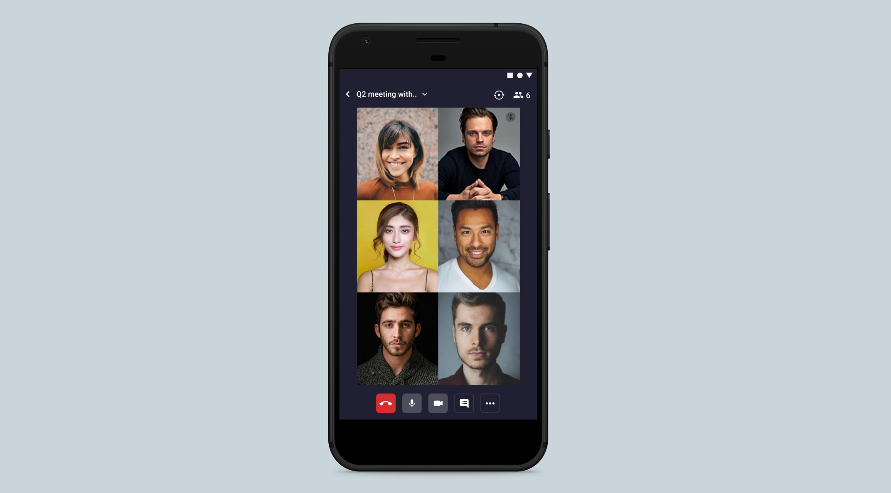

# Video SDK React Native App

## What is it?

This code sample demonstrates a one-to-one and group video call application built with [Video SDK RTC React Native SDK](https://docs.videosdk.live/docs/realtime-communication/sdk-reference/react-native-sdk/setup) and [Video SDK RTC React SDK](https://docs.videosdk.live/docs/realtime-communication/sdk-reference/react-sdk/setup)

- Built for serverless video calling experience in Android and iOS.
- Scale it upto 5,000 participants with low code.
- 10,000 minutes free on monthly basis



## Features

- [x] Video API with real-time audio, video and data streams
- [x] 5,000+ participants support
- [x] Chat support with rich media.
- [x] Screen sharing with HD and Full HD.
- [x] Play realtime video in meeting
- [x] Connect it with social media such as Facebook, Youtube etc (RTMP out support).
- [x] Intelligent speaker switch
- [x] Record your meetings on cloud
- [x] Customise UI and built other rich features with our new data streams such as whiteboard, poll, Q & A etc.
- [x] Develop and launch in both Android and iOS at the same time.

## Device Support

Visit our official guide for [Device Support](https://docs.videosdk.live/docs/realtime-communication/see-also/device-browser-support)

## Prerequisites

You must have the following installed:

- Node.js v12+
- NPM v6+ (comes installed with newer Node versions)
- Android Studio or Xcode installed

## Getting started

1. Run the authentication server
   Follow [videosdk-rtc-nodejs-sdk-example](https://github.com/videosdk-live/videosdk-rtc-nodejs-sdk-example) to run authentication server.

2. Clone the repo

   ```sh
   $ git clone https://github.com/videosdk-live/videosdk-rtc-react-native-sdk-example.git
   ```

3. Copy the `.env.example` file to `.env` file.

   ```sh
   $ cp .env.example .env
   ```

4. Update the api server url in the `.env` file that points to the authentication server.

   ```
   REACT_APP_SERVER_URL=http://localhost:9000
   ```

5. Install NPM packages

   ```sh
   $ npm install
   ```

6. Run the app

   ```sh
   $ npm run start
   $ npm android
   $ npm ios
   ```

For more information, visit [official documentation](https://docs.videosdk.live/docs/realtime-communication/sdk-reference/react-native-sdk/setup)

Related

- [Video SDK RTC React Example](https://github.com/videosdk-live/videosdk-rtc-react-sdk-example)
- [Video SDK RTC React Native Example](https://github.com/videosdk-live/videosdk-rtc-react-native-sdk-example)
- [Video SDK RTC Flutter Example](https://github.com/videosdk-live/videosdk-rtc-flutter-sdk-example)
- [Video SDK RTC Android Example](https://github.com/videosdk-live/videosdk-rtc-android-java-sdk-example)
- [Video SDK RTC iOS Example](https://github.com/videosdk-live/videosdk-rtc-ios-sdk-example)
